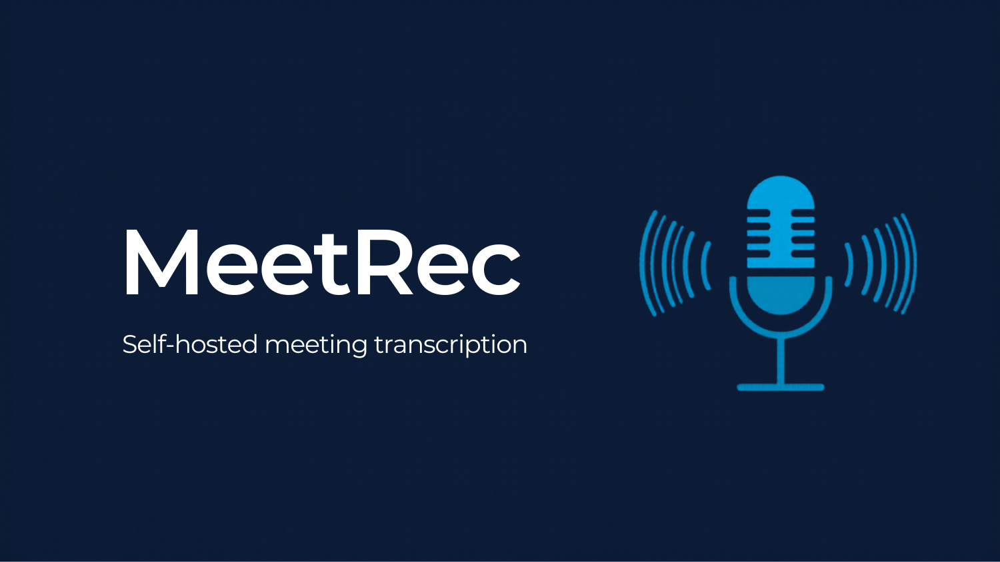

<div align="center">



# MeetRec

**The self-hosted meeting transcription platform that keeps your conversations private.**

[](https://python.org)
[](https://fastapi.tiangolo.com)
[](https://react.dev)
[](https://typescriptlang.org)
[](https://postgresql.org)
[](https://docker.com)
[](LICENSE)

*Drop an audio file. Get a searchable, exportable transcript in minutes.
Everything runs on your infrastructure — no cloud, no subscriptions, no data leaving your premises.*

[Quick Start](#quick-start) · [Features](#features) · [Architecture](#architecture) · [Configuration](#configuration) · [API Reference](#rest-api)

</div>

---

## Why MeetRec?

Every major transcription service — Otter.ai, Fireflies, Zoom AI — sends your recordings to someone else's cloud. For legal teams, medical staff, government agencies, and any organization that handles sensitive conversations, that is a non-starter.

MeetRec runs **entirely on your own server**. Transcription is powered by [OpenAI Whisper](https://github.com/openai/whisper) executing locally. No audio, no text, no metadata ever leaves your infrastructure.

| | MeetRec | Cloud services |
|---|---|---|
| **Data location** | Your server only | Third-party cloud |
| **Cost** | One-time infrastructure | Per-minute or per-seat subscription |
| **GDPR / compliance** | Full control | Dependent on vendor |
| **Air-gapped deployment** | ✅ Yes | ❌ No |
| **Custom retention policies** | ✅ Yes | Limited |
| **Semantic search** | ✅ Built-in | Usually paid add-on |
| **Audit log** | ✅ Complete | Varies |

---

## Features

### Core

- **Automatic transcription** — drop a file in `/data/inbox` and transcription starts immediately, no manual step required
- **Web upload** — drag-and-drop interface with real-time progress; supports MP3, MP4, WAV, M4A, OGG, FLAC, WEBM
- **Synchronized audio player** — click any transcript segment to jump to that exact moment in the recording
- **Virtual scrolling** — renders thousands of transcript segments without lag using `@tanstack/react-virtual`
- **Multi-segment session recording** — long meetings are split into 5-minute WAV segments, each uploaded with a shared `session_id`; the server assembles all segments before transcription so Whisper has full context at junctions; session duration is derived from ingest-measured audio durations (not Whisper timestamps)
- **Full merged-audio playback** — after transcription, the assembled WAV is stored permanently so the audio player can play the complete recording, not just the first segment
- **Modern UI** — complete frontend redesign with Inter font, indigo primary color system, dark slate sidebar, animated toasts, and polished card/badge/button components

### Search

- **Full-text search** — PostgreSQL `TSVECTOR` + GIN index with highlighted snippets and ranked results; Romanian language support built-in
- **Semantic search** — Sentence Transformers + pgvector HNSW index; finds conceptually related content even when exact words differ
- Both search modes available simultaneously from a single query box

### Export & Integration

- **PDF** — professionally formatted document with title, metadata, timestamps, and full transcript
- **DOCX** — Word-compatible file with proper heading styles and paragraph structure
- **TXT** — plain text with timestamps; easy to pipe into other tools
- **REST API** — full OpenAPI 3.0 spec; every feature available programmatically

### Security & Compliance

- **JWT authentication** (HS256) with configurable expiry; forced password change on first login
- **Role-based access control** — `admin`, `operator`, `participant` roles with granular permissions
- **Participant linking** — explicitly grant access to individual recordings per user
- **bcrypt** password hashing at cost factor 12
- **Rate limiting** — 5 req/min on login (brute-force protection), 20 req/hour on export
- **Complete audit log** — every action (upload, view, search, export, delete) recorded with user ID, IP, and timestamp; GDPR-compliant evidence trail
- **Auto-retention** — configurable automatic deletion after N days; scheduled nightly via APScheduler
- **Path traversal protection** — all file operations validated with `pathlib.Path.resolve()`
- **File validation** — type verified by magic bytes, not just extension; SHA-256 deduplication prevents duplicate uploads
- **CORS** restricted to explicit origins in production

---

## Desktop Client

A companion **Electron desktop app** is available for conference-room deployments. It records audio continuously, splits recordings into 5-minute WAV segments, and queues uploads to the MeetRec server with automatic retry on failure.

- Repository: [StefanJoita/MeetRec_desktop-client](https://github.com/StefanJoita/MeetRec_desktop-client)
- Works with the multi-segment session API (`POST /inbox/session/{id}/complete`)
- Queues segments locally and retries uploads if the network is temporarily unavailable
- Designed for always-on installation in meeting rooms; no manual intervention required
- Supports any USB audio device — select the microphone from a dropdown in the app

**Recommended hardware for meeting rooms:** a USB conference microphone (e.g. Jabra Speak 510 ~€100, Jabra Speak 750 ~€200) significantly improves transcription accuracy and speaker identification for 6–15 participants compared to a built-in PC microphone. These devices connect via USB and are detected automatically by the desktop client.

---

## Architecture

MeetRec is composed of six independent services that communicate through PostgreSQL and Redis. Each service has a single responsibility and can be scaled independently.

```
Browser / Desktop Client    Drop folder
    │                          │
    │ POST /api/v1/inbox/upload │ cp meeting.mp3 data/inbox/
    │ (or multi-segment         │
    │  session upload)          │
    ▼                          ▼
┌─────────────────────────────────────────────┐
│                   Nginx                     │  ← Reverse proxy + static assets
└──────────────┬──────────────────────────────┘
               │
               ▼
┌──────────────────────────┐
│         FastAPI          │  ← REST API: auth · CRUD · search · export · audit
└──────┬───────────────────┘
       │ writes audio to /data/inbox/
       ▼
┌──────────────────────────┐
│      Ingest Service      │  ← watchdog: detect → validate → deduplicate → queue
│  (format · size ·        │     + Session Watcher: assembles multi-segment sessions
│   duration · SHA-256)    │     → dispatches on timeout or /complete signal
└──────┬───────────────────┘
       │ RPUSH job
       ▼
┌──────────────────────────┐
│         Redis            │  ← Job queue
└──────┬───────────────────┘
       │ BLPOP job
       ▼
┌──────────────────────────┐     ┌───────────────────────┐
│      STT Worker          │────►│   Search Indexer      │
│  (OpenAI Whisper local)  │     │  (Sentence Transformers│
│  assembles segments,     │     │   + pgvector HNSW)    │
│  stores merged WAV       │     └──────────┬────────────┘
└──────┬───────────────────┘
       │                                    │
       └──────────────┬─────────────────────┘
                      ▼
           ┌─────────────────────┐
           │    PostgreSQL 15    │  ← Storage · FTS · vector search
           │  + pgvector ext.    │
           └─────────────────────┘
                      ▲
           ┌─────────────────────┐
           │  Audit Retention    │  ← Nightly cleanup · GDPR delete
           └─────────────────────┘
```

**Design principle:** the Ingest Service is the only entry point for audio. The API never touches audio files directly. This enforces validation and deduplication regardless of how files arrive (web upload, drop folder, or desktop client multi-segment session).

**Multi-segment sessions:** the desktop client uploads 5-minute WAV chunks tagged with a shared `session_id`. The Ingest Session Watcher monitors open sessions and dispatches transcription after 1800 s of inactivity or when `POST /inbox/session/{id}/complete` is called. The STT Worker then concatenates all segments before running Whisper and stores the merged WAV for full-session audio playback.

### Service summary

| Service | Technology | Responsibility |
|---|---|---|
| **API** | FastAPI + SQLAlchemy async | REST endpoints, JWT auth, business logic |
| **Ingest** | Python watchdog + asyncpg | File detection, validation, SHA-256 dedup, queuing; Session Watcher for multi-segment sessions |
| **STT Worker** | OpenAI Whisper + asyncpg | Audio assembly, speech-to-text, segment extraction, merged WAV storage |
| **Search Indexer** | Sentence Transformers + pgvector | Semantic embedding generation via LISTEN/NOTIFY |
| **Audit Retention** | APScheduler | Nightly GDPR-compliant auto-delete |
| **Frontend** | React 18 + Vite + TailwindCSS | SPA: upload, browse, search, export, admin |
| **PostgreSQL** | pgvector/pgvector:pg15 | Relational storage, TSVECTOR FTS, vector search |
| **Redis** | redis:7-alpine | Async job queue between Ingest and STT Worker |
| **Nginx** | nginx:1.25-alpine | Reverse proxy, TLS termination, static file serving |

---

## Quick Start

### Windows (recommended)

Requirements: [Docker Desktop](https://www.docker.com/products/docker-desktop/), [Git for Windows](https://git-scm.com).

```powershell
git clone https://github.com/StefanJoita/MeetRec.git
cd MeetRec
.\install\install.ps1
```

> If PowerShell blocks the script, run once: `Set-ExecutionPolicy -Scope CurrentUser RemoteSigned`

### Linux (Ubuntu/Debian)

```bash
git clone https://github.com/StefanJoita/MeetRec.git
cd MeetRec
bash install/install.sh
```

Both installers handle everything: Docker check, `.env` generation, SSL certificates, Docker build, service startup, and admin account creation.

### Manual / other platforms

```bash
# 1. Clone
git clone https://github.com/StefanJoita/MeetRec.git
cd MeetRec

# 2. Configure
cp .env.example .env
# Edit .env: set JWT_SECRET_KEY (min 32 chars), POSTGRES_PASSWORD, SERVER_NAME

# 3. Generate JWT secret
python -c "import secrets; print(secrets.token_hex(32))"

# 4. SSL certificates
bash install/scripts/gen-self-signed.sh localhost

# 5. Create data directories
mkdir -p data/inbox data/processed data/exports

# 6. Start
docker compose up --build -d

# 7. Verify
curl http://localhost:8080/health
# → {"status": "healthy", ...}
```

> **First startup:** Whisper `medium` model (~1.5 GB) downloads automatically on the first run. Subsequent starts are instant.

| Endpoint | URL |
|---|---|
| Web UI | `https://localhost` |
| API docs (dev only) | `http://localhost:8080/docs` |
| Health check | `http://localhost:8080/health` |

See [`docs/INSTALL.md`](docs/INSTALL.md) (Romanian) or [`docs/INSTALL.en.md`](docs/INSTALL.en.md) (English) for the full installation guide.

---

## Usage

### Drop-folder

The simplest way to ingest recordings — no browser required:

```bash
cp board-meeting.mp3 data/inbox/

# Follow progress
docker compose logs -f ingest stt-worker
```

Ingest validates the file (format, size, duration, SHA-256 dedup), adds it to the queue, and the STT Worker picks it up within seconds.

### Web Interface

1. Open `http://localhost` and log in
2. **New Recording** — drag-and-drop or click to upload; optionally add title, description, location, participants
3. Transcription progress updates in real time on the recording page
4. Click any segment in the transcript to seek the audio player to that moment
5. **Search** — full-text or semantic queries across all recordings, with highlighted snippets
6. **Export** — download as PDF, DOCX, or TXT from the recording detail page

### REST API

```bash
# Authenticate
TOKEN=$(curl -s -X POST http://localhost:8080/api/v1/auth/login \
  -H "Content-Type: application/json" \
  -d '{"username": "admin", "password": "your-password"}' \
  | jq -r '.access_token')

# Upload a recording
curl -X POST http://localhost:8080/api/v1/inbox/upload \
  -H "Authorization: Bearer $TOKEN" \
  -F "file=@meeting.mp3" \
  -F "title=Board Meeting Q1" \
  -F "meeting_date=2026-03-22"
# → 202 Accepted {"id": "...", "status": "queued"}

# List recordings
curl -H "Authorization: Bearer $TOKEN" \
  "http://localhost:8080/api/v1/recordings?page=1&page_size=20"

# Full-text search
curl -H "Authorization: Bearer $TOKEN" \
  "http://localhost:8080/api/v1/search?q=budget+2026&mode=fulltext"

# Semantic search
curl -H "Authorization: Bearer $TOKEN" \
  "http://localhost:8080/api/v1/search?q=cost+reduction+strategy&mode=semantic"

# Export as PDF
curl -H "Authorization: Bearer $TOKEN" \
  "http://localhost:8080/api/v1/export/recording/{id}?format=pdf" \
  --output transcript.pdf
```

Full OpenAPI specification available at `/docs` when `APP_ENV=development`.

---

## Configuration

All settings are read from `.env`. Copy `.env.example` to get started.

### Required

| Variable | Description |
|---|---|
| `JWT_SECRET_KEY` | Signing key — **minimum 32 characters, cryptographically random** |
| `POSTGRES_PASSWORD` | PostgreSQL password |
| `DATABASE_URL` | `postgresql+asyncpg://meetrec:<password>@postgres:5432/meetrec_db` |

### Whisper model sizes

| Model | Size | Speed | Accuracy |
|---|---|---|---|
| `tiny` | 75 MB | Fastest | Basic |
| `base` | 145 MB | Fast | Good |
| `small` | 465 MB | Moderate | Better |
| `medium` | 1.5 GB | Moderate | **Recommended** |
| `large` | 2.9 GB | Slow | Best |

Set with `WHISPER_MODEL=medium` in `.env`.

### Key optional settings

| Variable | Default | Description |
|---|---|---|
| `WHISPER_MODEL` | `medium` | Whisper model size |
| `RETENTION_DAYS` | `1095` | Auto-delete after N days (3 years) |
| `APP_ENV` | `development` | Set `production` to disable `/docs` and restrict CORS |
| `MAX_FILE_SIZE_BYTES` | `524288000` | Max upload size (500 MB) |
| `SEARCH_INDEXER_ENABLED` | `true` | Enable semantic search embeddings |
| `SESSION_TIMEOUT_SECONDS` | `1800` | Inactivity timeout before an open multi-segment session is auto-dispatched |

---

## Security

MeetRec is built for organizations where data privacy is non-negotiable.

- Audio files never leave your server — Whisper runs fully on-premise
- All API endpoints require a valid JWT; tokens expire and can be revoked
- Role-based access control with three tiers: `admin`, `operator`, `participant`
- Participant-level access allows granting specific users access to individual recordings only
- Every user action is audit-logged with IP, timestamp, and user identity — suitable for legal and compliance evidence
- Configurable retention: recordings are automatically and permanently deleted after your specified period
- Content-Security-Policy headers set by Nginx in production
- File uploads validated by magic bytes before any processing occurs

> Set `APP_ENV=production` before any public-facing deployment. Never expose the development API docs in production.

---

## Project Structure

```
MeetRec/
├── services/
│   ├── api/                    # FastAPI application
│   │   ├── src/
│   │   │   ├── routers/        # auth · recordings · search · export · users · inbox
│   │   │   ├── services/       # recording_service · transcript_service · user_service
│   │   │   ├── models/         # SQLAlchemy ORM models
│   │   │   ├── schemas/        # Pydantic request/response schemas
│   │   │   └── middleware/     # JWT auth · audit logging · rate limiting
│   │   └── alembic/            # Database migrations (001–007)
│   ├── ingest/                 # File watcher, validator, queue producer
│   ├── stt-worker/             # Whisper transcription worker
│   ├── search-indexer/         # Sentence Transformers + pgvector indexer
│   └── audit-retention/        # Scheduled cleanup service
├── frontend/
│   └── src/
│       ├── pages/              # RecordingsList · Detail · Search · Admin · Login
│       ├── components/         # AudioPlayer · TranscriptViewer · ParticipantLinker
│       ├── api/                # Typed axios client with JWT interceptors
│       └── contexts/           # AuthContext · ToastContext
├── install/
│   ├── install.ps1             # Windows automated installer
│   ├── install.sh              # Linux automated installer
│   └── scripts/                # gen-self-signed.sh · gen-letsencrypt.sh
├── docs/
│   ├── INSTALL.md              # Installation guide (Romanian)
│   └── INSTALL.en.md           # Installation guide (English)
├── database/
│   └── init.sql                # Base schema with indexes and pgvector
├── nginx/                      # Reverse proxy config + SSL
├── docker-compose.yml
└── .env.example
```

---

## Implementation Status

| Component | Status |
|---|---|
| Ingest Service (format · size · duration · SHA-256 dedup) | ✅ Complete |
| STT Worker (Whisper, retry logic, async) | ✅ Complete |
| API — auth, CRUD, search, export, audit | ✅ Complete |
| Role-based access control (admin / operator / participant) | ✅ Complete |
| Participant-level recording access | ✅ Complete |
| Frontend — upload, list, detail, search, admin | ✅ Complete |
| Real-time transcription progress | ✅ Complete |
| Synchronized audio + transcript player | ✅ Complete |
| Full-text search (TSVECTOR + GIN, Romanian) | ✅ Complete |
| Semantic search (Sentence Transformers + pgvector HNSW) | ✅ Complete |
| Export — PDF, DOCX, TXT | ✅ Complete |
| Audit log with human-readable user identity | ✅ Complete |
| Audit retention & GDPR auto-delete | ✅ Complete |
| Virtual scrolling (1000+ segments) | ✅ Complete |
| Database migrations (001–007) | ✅ Complete |
| Multi-segment session recording (Session Watcher + audio assembly) | ✅ Complete |
| Desktop client integration (Electron companion app) | ✅ Complete |
| Full session audio playback (merged WAV stored post-transcription) | ✅ Complete |
| Modern UI redesign (Inter font, indigo palette, dark sidebar, animated toasts) | ✅ Complete |
| `POST /inbox/session/{id}/complete` explicit dispatch endpoint | ✅ Complete |

---

## License

Proprietary — all rights reserved. Contact the repository owner for licensing inquiries.
